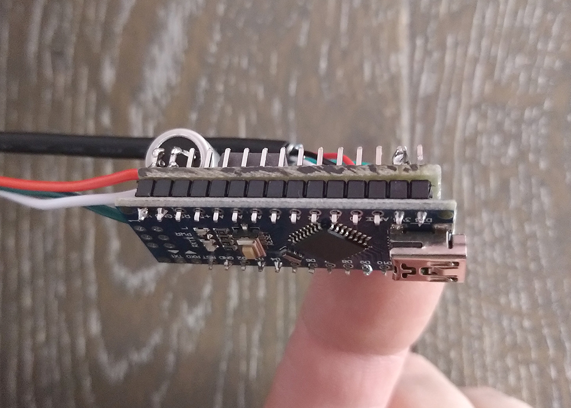

This project uses an Arduino Nono with a bedside located illuminated button to control a WS2811/WS2812 LED strip for my 
little daugther's Night Light. 

_Sounds like an overkill?_  **No** - this has the following advantages:
 - Automatic turn off after programmable time - the light is not on for the whole night.
 - Fade out to show that light will turn off soon - so stay close to the button if re-enabling light is desired.
 
# Overview
The images below show the main parts of the system.

| Button Mounted | Top View of Circuit | Side View of circuit |
| ---            | ---                 |   ---                |
|  |  |  |

## Circuit
The following circuit was drawn with Fritzing and is located in [`img/drawing.fzz`](./img/drawing.fzz) folder. 

The transistor used in this example is a `BD645`. But any transistor capable for the current drawn by the LED strip 
could be used. 
The capacitor with `470uF` buffers the energy for the LED strip. This way the supply voltage should be stable even with 
long supply leads.

## Main Components
| Item | Supplier - Partnumber | Image | Details |
| ---  | ---                   | ---   | ---     |
| Arduino Nano | Ebay - Arduino Nano V3.0 (ATmega328) |  | [Datasheet](datasheet/NanoV3.0_ATmega328_eBay.pdf) |
| Button |  Ebay - "LED Drucktaster Gelb Druckknopf Taster Schalter Push Button 19mm" |  | [Datasheet](datasheet/button_eBay.pdf) |
| LED Stip | Ebay - "5m adressierbar WS2812B ws2811 IC 5050 144 RGB LED 5V Streifen" |  | [Datasheet](datasheet/5m_WS2812B_IC5050_144_LED_RGB_5V_eBay.pdf)

## Code
The project can be compiled by using the [Arduino App](https://www.arduino.cc/download) or by using 
[CLion](https://www.jetbrains.com/clion/). This is why the project folder contains all the CMake files.

For controlling the LEDs, the Adafruit NeoPixel library is used. But you do not have to install it, as it is located 
in the `src/` directory.